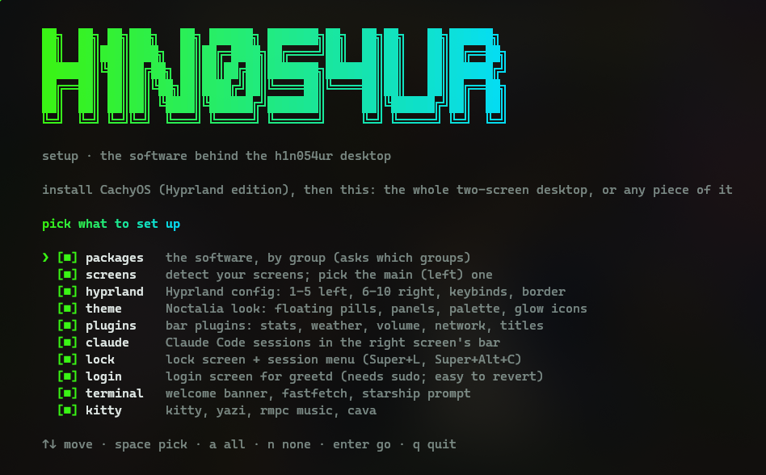
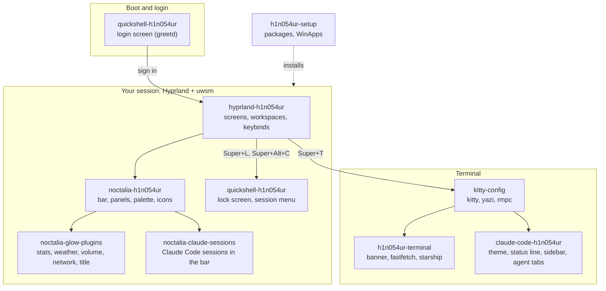
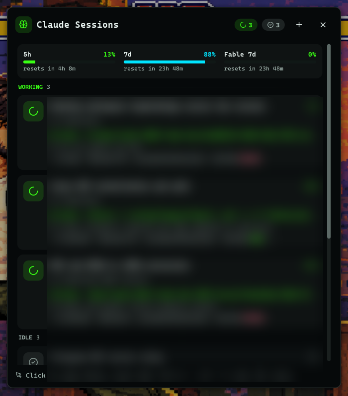
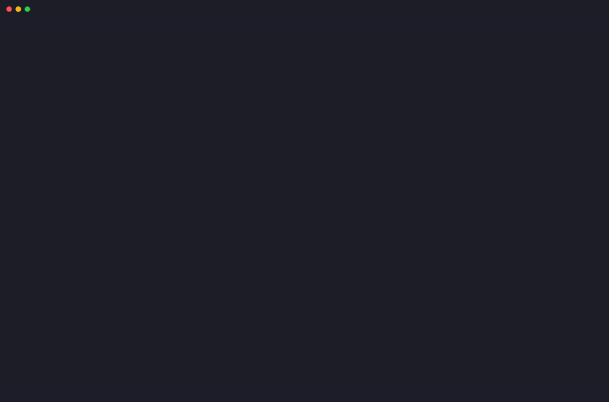
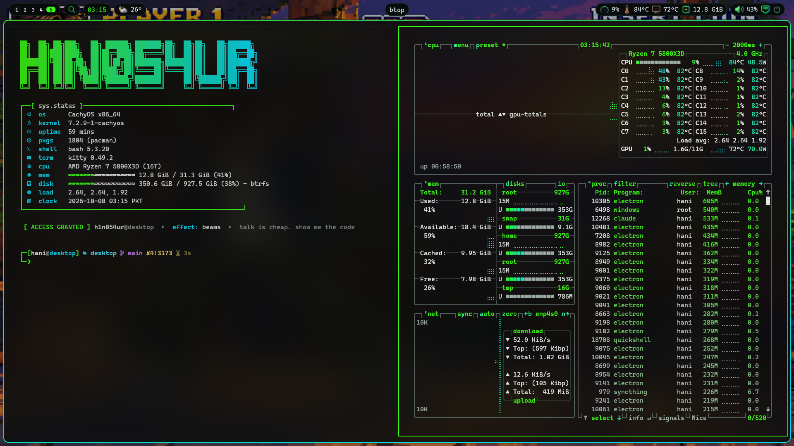
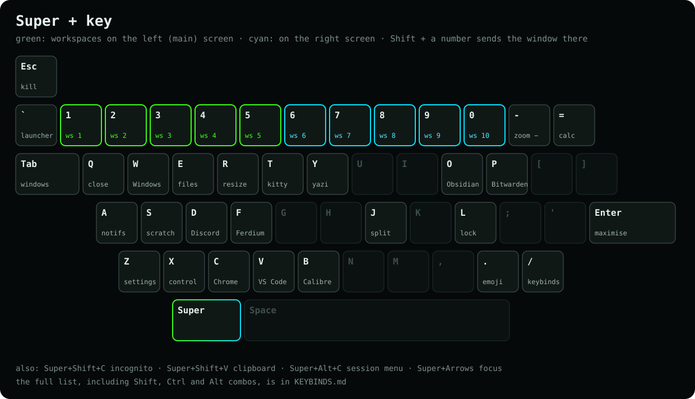

# h1n054ur desktop

**Install CachyOS, run one script, get this desktop.** A two-screen Hyprland setup with the Noctalia shell in a dark green-to-cyan terminal look, my own bar plugins, a matching login and lock screen, the terminal, and the software and Windows apps I use. Take all of it, or any single piece: every folder here is also its own repository.


## Install

1. Install [CachyOS](https://cachyos.org) and pick the **Hyprland** desktop. Log in once.
2. Run:

```sh
curl -fsSL https://raw.githubusercontent.com/h1n054ur/desktop/main/install.sh | bash
```

or from a clone: `git clone https://github.com/h1n054ur/desktop && cd desktop && ./install.sh`.

The installer shows a checklist of components, everything ticked: untick what you don't want. It asks which software groups to install, detects your screens and lets you pick the main one, then sets each piece up with a spinner, a progress bar and a log. Anything it replaces is backed up next to the original first. `./install.sh --dry-run` walks through all of it without changing a thing, and `./install.sh theme plugins --yes` installs only those pieces.



| Component | What it sets up |
|---|---|
| `packages` | the software, by group: desktop, terminal, media, dev (with Claude Code), apps, WinApps, mail, network, gaming |
| `screens` | finds your screens, asks which is the main one, writes the layout |
| `hyprland` | the Hyprland config: workspaces 1-5 left and 6-10 right, keybinds, the gradient border |
| `theme` | the Noctalia look: floating pills, floating panels, palette, glow icons, and the right screen's own bar |
| `plugins` | the glow bar plugins: stats, weather, volume, network, per-screen window titles |
| `claude` | Claude Code sessions and plan limits in the right screen's bar |
| `lock` | the lock screen and session menu (Super+L, Super+Alt+C) |
| `login` | the login screen for greetd (sudo; `sudo quickshell/greeter/install.sh revert` undoes it) |
| `terminal` | the welcome banner, fastfetch panel and starship prompt |
| `kitty` | kitty, yazi, rmpc music and cava |
| `claudecode` | the Claude Code look: theme, status line, task sidebar and agent tabs |

It's built for **two screens**, and works on one: then all ten workspaces share it.

## Two screens

I use two 1080p screens side by side, and the whole setup is built around that split. The left screen is the main one: workspaces 1 to 5, the full bar (search, clock, weather, system stats, volume, network, power) and the sign-in panel. The right screen holds workspaces 6 to 10, a slim bar (Claude sessions, tray) and the clock at login. Screens are matched by serial number, so the roles stay put whatever port each cable is in. On a laptop alone everything shares one screen.


## The pieces

| Folder | Repository | What it is |
|---|---|---|
| [`terminal/`](terminal) | [h1n054ur-terminal](https://github.com/h1n054ur/h1n054ur-terminal) | animated welcome banner, fastfetch panel and starship prompt for bash, zsh and PowerShell (Linux, macOS, Windows) |
| [`kitty/`](kitty) | [kitty-config](https://github.com/h1n054ur/kitty-config) | kitty with splits and smart paste, yazi with previews, rmpc music with cava (Arch, Debian/WSL, macOS) |
| [`noctalia-theme/`](noctalia-theme) | [noctalia-h1n054ur](https://github.com/h1n054ur/noctalia-h1n054ur) | the bar with floating pills, floating panels, the palette and the glow icons |
| [`noctalia-glow-plugins/`](noctalia-glow-plugins) | [noctalia-glow-plugins](https://github.com/h1n054ur/noctalia-glow-plugins) | Noctalia plugins: stats that heat up, weather with a forecast panel, volume, network, a per-screen window title |
| [`noctalia-claude-sessions/`](noctalia-claude-sessions) | [noctalia-claude-sessions](https://github.com/h1n054ur/noctalia-claude-sessions) | Claude Code sessions and plan limits in the bar (a fork of lfdominguez's plugin with a floating panel) |
| [`claude-code/`](claude-code) | [claude-code-h1n054ur](https://github.com/h1n054ur/claude-code-h1n054ur) | Claude Code in the h1n054ur palette: a theme, a starship-style status line, a task sidebar and a tab bar for running agents |
| [`quickshell/`](quickshell) | [quickshell-h1n054ur](https://github.com/h1n054ur/quickshell-h1n054ur) | login screen for greetd, lock screen and session menu, built with Quickshell |
| [`hyprland/`](hyprland) | [hyprland-h1n054ur](https://github.com/h1n054ur/hyprland-h1n054ur) | the Hyprland Lua config: screens, workspaces, keybinds, window rules |
| [`setup/`](setup) | [h1n054ur-setup](https://github.com/h1n054ur/h1n054ur-setup) | an interactive installer for the software by group, and Windows apps through WinApps |



## A tour

| Login | Lock screen | Session menu |
|---|---|---|
|  |  |  |

| Weather | System | Claude sessions |
|---|---|---|
|  |  |  |

| Terminal | kitty splits |
|---|---|
|  |  |



## Doing it by hand

Each folder's README explains its piece on its own, if you'd rather not run the installer. Nothing here holds machine-specific values: screens, users and secrets go in files that stay out of git, and each README says which.

## How this repo works

All work happens here. On every push, CI splits each folder into its own repository with [splitsh-lite](https://github.com/splitsh/lite) and pushes it, so the standalone repos are read-only copies: open issues and pull requests here. [`splits.toml`](splits.toml) lists which folder goes where.

## Licence

MIT for everything here, see each folder's LICENSE. The Claude Sessions fork keeps lfdominguez's credit.
