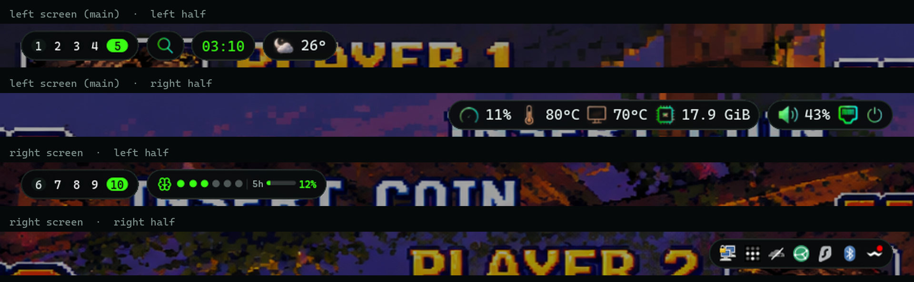
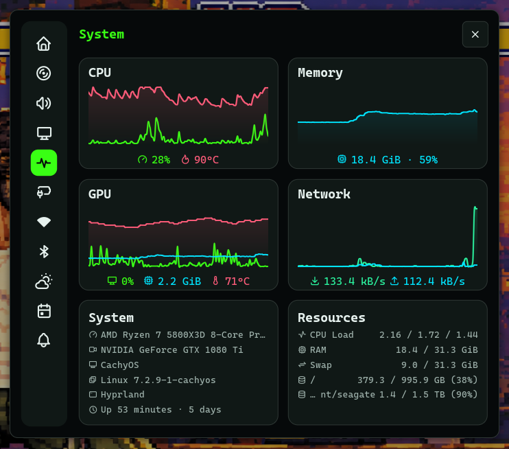
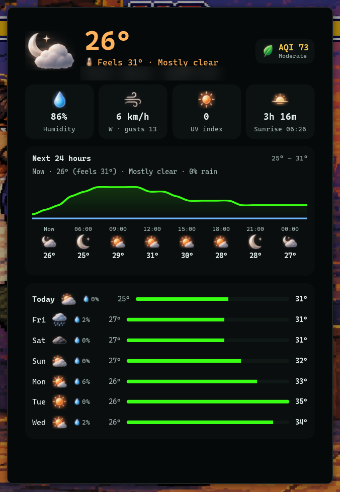
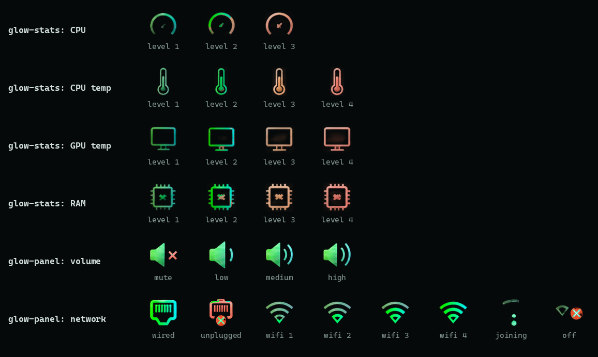
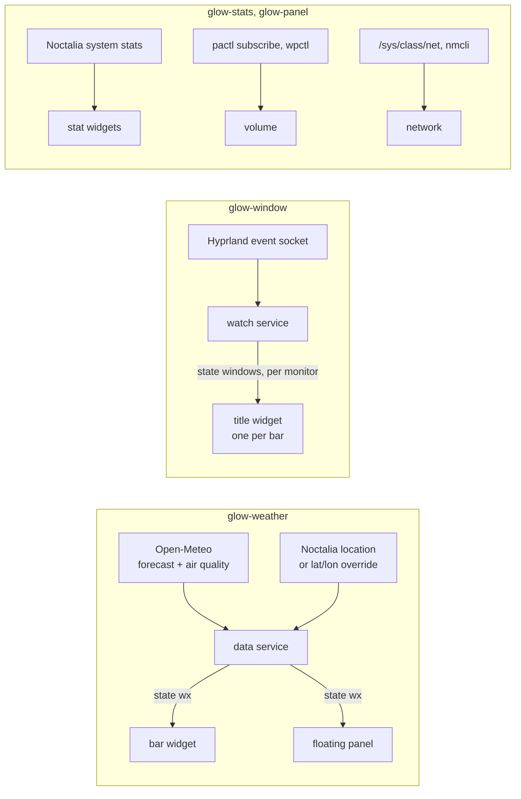

# Glow plugins for Noctalia

Four bar widgets for [Noctalia](https://github.com/noctalia-dev/noctalia) built around one set of glow icons: system stats that warm up as the machine gets busy, weather with a full forecast panel, volume and network, and a window title that follows each screen on its own.



| Plugin | ID | What it shows |
|---|---|---|
| glow-stats | `hani/glow-stats` | CPU load, CPU temperature, GPU temperature or RAM, one stat per widget |
| glow-weather | `hani/glow-weather` | Temperature on the bar, with a forecast panel on click |
| glow-panel | `hani/glow-panel` | Volume (`volume`) and network (`network`) widgets |
| glow-window | `hani/glow-window` | The window on this screen's workspace, per bar, on Hyprland |

## glow-stats

Each widget shows one stat with an icon that steps through heat levels: cool at idle, then warmer, then red, with the value in red at the top level. Hover for a tooltip with CPU load and clock, both temperatures, GPU load, RAM and the load average. Clicking opens Noctalia's control centre on its System tab.

| Stat | Levels |
|---|---|
| `cpu` | under 30 %, under 70 %, above |
| `cpu_temp` | under 55 °C, 70 °C, 85 °C, above |
| `gpu_temp` | under 50 °C, 65 °C, 80 °C, above |
| `ram` | under 40 %, 65 %, 85 %, above |

Settings: `stat` (`cpu`, `cpu_temp`, `gpu_temp`, `ram`) and `show_value`.



## glow-weather

The bar shows the condition icon and the temperature. Hovering it adds the condition, a sparkline of the next 12 hours and an air-quality dot. Clicking opens the panel: current conditions with feels-like and AQI, humidity, wind, UV and the next sunrise or sunset, a 24-hour graph with hourly icons, and a 7-day forecast.



Data comes from [Open-Meteo](https://open-meteo.com/) (forecast and air quality), with no API key. The location is Noctalia's own (`[location]`), or set `latitude` and `longitude` in the plugin settings to override it.

| Setting | Default | |
|---|---|---|
| `refresh_minutes` | `15` | How often to fetch |
| `latitude`, `longitude` | `0` | Leave both at 0 to use Noctalia's location |
| `temperature` | `actual` | `actual` or `feels` on the bar |
| `sparkline` | `temp` | `temp`, `rain` or `off` |
| `show_condition`, `show_aqi` | `true` | Extra details on hover |

The panel is `floating`, so it brings its own card and suits transparent bars.

## glow-panel

`volume` shows a level icon (mute, low, medium, high) and the percentage. `pactl subscribe` pushes changes, so scrolling or muting updates it right away. Click for the audio tab of the control centre, right-click to mute, scroll to change the volume.

`network` shows Ethernet when a cable link is up, otherwise Wi-Fi by signal strength, joining or off. Hover for the interface, address, SSID and signal. Click for the network tab of the control centre.

## glow-window

Each bar shows the window that is focused on its own screen's visible workspace, with the app icon, and hides when that workspace is empty. A small service listens to Hyprland's event socket, so titles change as soon as focus or workspaces do. `max_width` (default 420 px) caps the title; define a second widget with a smaller value for a crowded bar.

This is what makes it useful with two screens. A plain window-title widget follows keyboard focus, so both bars would show the same title. Here the left bar shows what is on the left screen (workspaces 1 to 5) and the right bar what is on the right one (6 to 10), whichever you are typing in. On the main screen I use a shorter copy (`max_width = 340`) so the title and the music pill fit in the middle together.

## Icons



The icons come from one AI-generated sheet of glow icons, recoloured green to cyan. Warm heat levels and red warning marks (mute, unplugged, off) keep their colours, so they still stand out. The [h1n054ur theme](https://github.com/h1n054ur/noctalia-h1n054ur) that uses these plugins has the recolour script, which works on any icon folder.

## How it works



## Install

Add this repo as a plugin source and enable the plugins you want:

```sh
noctalia msg plugins source add glow git https://github.com/h1n054ur/noctalia-glow-plugins
noctalia msg plugins enable hani/glow-stats
noctalia msg plugins enable hani/glow-weather
noctalia msg plugins enable hani/glow-panel
noctalia msg plugins enable hani/glow-window
```

Then define widgets in `~/.config/noctalia/config.toml` and place them on a bar:

```toml
[widget.cpu]
type = "hani/glow-stats:stat"
stat = "cpu"

[widget.weather]
type = "hani/glow-weather:bar"

[widget.volume]
type = "hani/glow-panel:volume"

[widget.network]
type = "hani/glow-panel:network"

[widget.title]
type = "hani/glow-window:title"

[bar.default]
start = [ "weather", "cpu" ]
center = [ "title" ]
end = [ "volume", "network" ]
```

glow-panel needs `pactl` and `wpctl` (PipeWire), glow-window needs `hyprctl` and `python3`.

## Part of h1n054ur/desktop

This repo is generated from the `noctalia-glow-plugins/` folder of [h1n054ur/desktop](https://github.com/h1n054ur/desktop). It is read-only: open issues and pull requests there.

## Licence

MIT, see [LICENSE](LICENSE).
